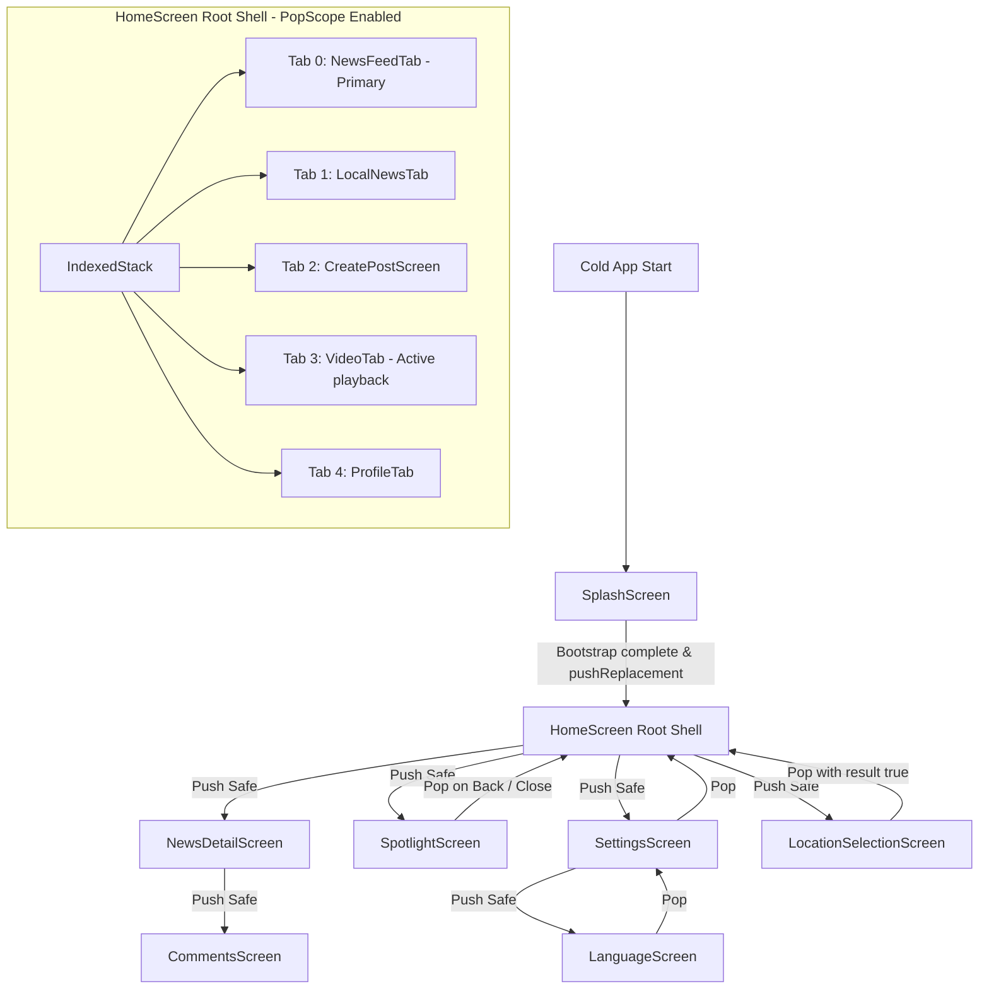

# Navigation Architecture & Android Back System — Vaaradhi

**Version:** Production Navigation Architecture (STEP 5)  
**Target:** Android 13+ / 14+ Predictive Back, Deterministic Root Flow & Tab State Management  
**Status:** Verified & Active  

---

## 1. System Architecture Overview

The Vaaradhi mobile client implements a deterministic, single-root navigation model built natively on Flutter's `Navigator`, `PopScope`, and `IndexedStack`. It guarantees zero duplicate root instances, preserves tab state across switching, protects against rapid consecutive double-tap pushes, and integrates seamlessly with Android 13+ / 14+ system predictive back gestures.

### Conceptual Navigation Diagram



---

## 2. The Single Root Shell Model

1. **Root Definition:**  
   `HomeScreen` is the sole conceptual root route (`route.isFirst == true`).
2. **Cold Start Flow:**  
   `SplashScreen` executes concurrently:
   - Backend health check (`ApiService.checkHealth()`)
   - Device registration / session validation
   - Minimum splash duration (1600ms)
   Upon completion, it executes `pushReplacement` to `HomeScreen()`.
3. **No Root Stack Duplication:**  
   Secondary flows (`SpotlightScreen`, `AccountLoginScreen`, `AccountSignupScreen`, `LocationSelectionScreen`, `LanguageScreen`) never push duplicate `HomeScreen` instances. When `canPop()` is true, they safely call `Navigator.pop(context)`. If popped from a fresh entry where `!canPop()`, they perform `pushReplacement` to `HomeScreen`.

---

## 3. Tab State & Switching Rules

`HomeScreen` hosts its 5 primary tabs in an `IndexedStack`:
- **Tab 0:** `NewsFeedTab` (Primary Root Tab)
- **Tab 1:** `LocalNewsTab`
- **Tab 2:** `CreatePostScreen`
- **Tab 3:** `VideoTab`
- **Tab 4:** `ProfileTab`

### Tab Navigation Rules:
- Tapping bottom navigation bar items changes `_navIndex`. It **never** pushes a route for standard tab switching.
- Each tab preserves its scroll position, local state, and cached articles within the `IndexedStack`.
- **Video Tab Lifecycle Integration:** `VideoTab` receives `isActive: _navIndex == 3`. When the user switches to another tab, `VideoTab` automatically pauses active video playback without clearing feed data. When the user returns to `VideoTab`, playback resumes smoothly according to Step 3 lifecycle rules.
- **Authentication Return on Create Tab:** When an unauthenticated user taps Tab 2 (Create Post), `AccountLoginScreen` is pushed. Upon successful login, the result is captured (`result == true`) and `_navIndex` automatically switches to Tab 2, delivering the user to their intended destination.

---

## 4. Deterministic Back Button Priority Algorithm

When an Android system back event or edge swipe occurs, back handling proceeds in strict priority:

```
Android Back Event Triggered
            │
            ▼
1. Is an active Dialog or Modal Bottom Sheet open?
   ├── YES ──► Pop modal route. Return handled.
   └── NO
            │
            ▼
2. Is the current route a Secondary Page (e.g., Comments, Article, Settings)?
   ├── YES ──► Pop secondary route to parent. Return handled.
   └── NO
            │
            ▼
3. Is a secondary form open with unsaved changes (CreatePostScreen)?
   ├── YES ──► Show "Discard post?" confirmation dialog.
   │           Keep editing ──► Return handled.
   │           Discard ──────► Clear inputs and pop route.
   └── NO
            │
            ▼
4. Is SpotlightScreen open?
   ├── YES ──► Stop TTS (AppTtsService.stop()), pop to HomeScreen.
   └── NO
            │
            ▼
5. Is the user on a Non-Primary Tab (Local, Create, Video, Profile)?
   ├── YES ──► Switch _navIndex to 0 (NewsFeedTab). Return handled.
   └── NO
            │
            ▼
6. Root Tab (NewsFeedTab): Double-Back Exit Window
   ├── First Press ─────────► Display "Press back again to exit" floating SnackBar.
   └── Second Press (<= 2s) ► Execute SystemNavigator.pop() to exit safely.
```

---

## 5. Android 13+ / 14+ Predictive Back

### AndroidManifest Opt-In
In `android/app/src/main/AndroidManifest.xml`, the `<application>` element is configured with:
```xml
android:enableOnBackInvokedCallback="true"
```
This enables Android's ahead-of-time predictive back gesture animations on API 33 (Android 13) and API 34+ (Android 14+).

### PopScope Ahead-of-Time Decision
- Routes that can be dismissed naturally without blocking declare `canPop: true` (or `canPop: Navigator.of(context).canPop()`). This allows the Android OS to immediately begin the predictive swipe preview (peeking at the previous route underneath).
- Root routes and forms with unsaved changes declare `canPop: false` dynamically:
  - In `HomeScreen`: `canPop: false` prevents accidental root termination, routing the back press to `_handleBack()`.
  - In `CreatePostScreen`: `canPop: !_hasUnsavedChanges` allows instant predictive back when no draft exists, while switching to confirmation dialog mode when inputs exist.

---

## 6. Duplicate Route & Rapid-Tap Protection (`AppNavigator`)

To eliminate duplicate route stacking caused by rapid successive taps on article cards, trending rails, or settings buttons:
- `AppNavigator.pushSafe<T>(context, route)`:
  - Tracks navigation debounce state (`_debounceDuration = 500ms`).
  - Consecutive taps within the transition window are safely dropped with diagnostic logging.
  - Releases throttle automatically when transition settles.
- `AppNavigatorObserver`:
  - Centralized debug observer attached to `MaterialApp(navigatorObservers: [AppNavigatorObserver.instance])`.
  - Tracks stack depth and route transitions (`PUSH`, `POP`, `REMOVE`, `REPLACE`) without logging any sensitive payload data.

---

## 7. Deep Linking & Notification Navigation

- Supported deep link scheme: `varadhi://category/{name}` and notification slugs (`article`, `poster`, `ugc`).
- When a notification arrives, `NotificationService` pushes `NewsDetailScreen` or `PosterDetailScreen` on top of the root `HomeScreen`.
- Pressing Android back from a notification-opened article pops cleanly back to `HomeScreen` without recursive splash or login redirects.
